# Практическая работа №1

Команда | Назначение | Скриншот
---|---|---
`w` | Отображает информацию о текущих авторизованных пользователях на машине, статистику, и их исполняемые процессы | 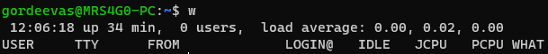 [Баг WSL](https://askubuntu.com/questions/1365678/who-command-produces-no-output-on-wsl2)
`whoami` | Отображает логин текущего пользователя | 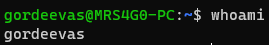
`who` | Отображает логины авторизованных пользователей | [Баг WSL](https://askubuntu.com/questions/1365678/who-command-produces-no-output-on-wsl2)
`last` | Отображает список последних авторизованных пользователей | 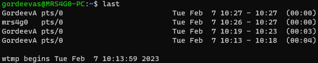
`users` | Отображает имена пользователей авторизованных на текущей машине | [Баг WSL](https://askubuntu.com/questions/1365678/who-command-produces-no-output-on-wsl2)
`logout` | Изменяет базу учетных записей пользователей для отображения. Без параметров выходит из системы | 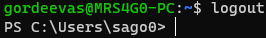
`date` | Отображает или устанавливает дату и время в системе (параметр -u выводит время в формате UTC) | 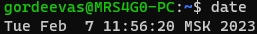 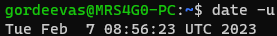
`cal` | Отображает календарь и дату | 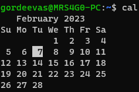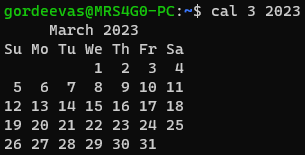
`man` | Открывает справку о команде | 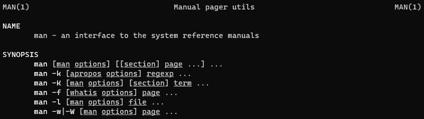
`whatis` | Отображает однострочное описание команды | 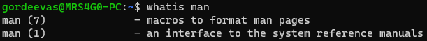
`apropos` | Поиск в справочнике по имени и описанию команды | 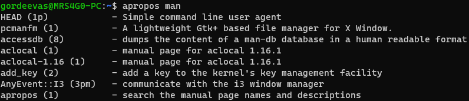
`arch` | Отображает архитектуру системы | 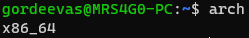
`echo` | Вывод сообщения в терминал | 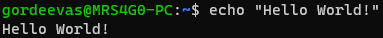
`clear` | Очистка терминала | 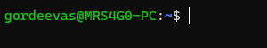
`exit` | Функция нормального завершения процесса. Без аргументов завершает процесс пользователя и выходит из системы | 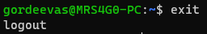
`uptime` | Показывает как долго система была запущена | 

## Ответы на вопросы

1. Для изменения текущей даты и времени команда date выполняется с аргументом формата MMDDhhmmYYYY.ss, где:

    MM - месяц;\
    DD - день;\
    hh - часы;\
    mm - минуты;\
    YY - год;\
    ss - секунды;

    `date 033112302022.00`\
    `Ср 31 мар 2022 12:30:00 +03`

    Более удобный способ задания времени:\
    `sudo date --set "2020-05-01 10:55:36"`

    Вывод даты:\
    `date`

2. Команда для вывод пользователей, которые в данный момент находятся в системе:

    `who`

3. Для завершения работы следует использовать команды:

    `exit`\
    `logout`

4. Вывод имени текущего пользователя:

    `whoami`

5. Вывод тип аппаратной платформы:

    `arch`

6. Вывод строки в терминал:

    `echo "String"`

7. Информация об авторизованных пользователях:

    `users`

8. Очистка терминала:

    `clear`

9. Вывод руководства по команде:

    `man <command>`

10. Вывод информации о работе системы:

    `uptime`
