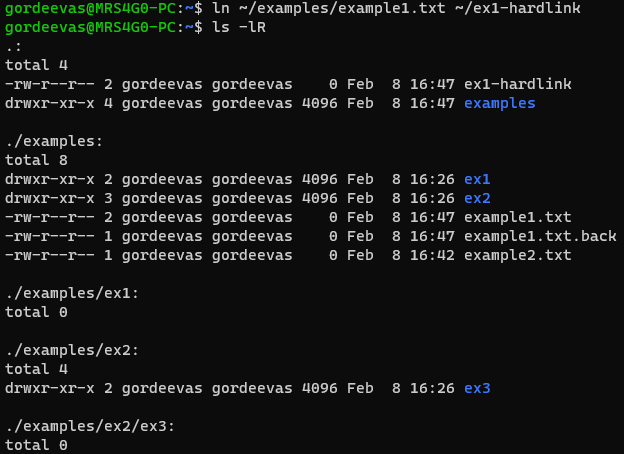
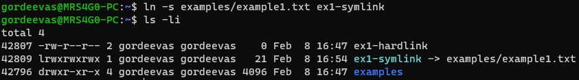

# Практическая работа №2

Команда | Назначение | Скриншот
---|---|---
`ls /` | Просмотр содержимого корневой директории | 
`ls` | Просмотр содержимого текущей директории | 
`pwd` | Просмотр текущей директории | 
`ls -F /` | Просмотр содержимого корневой директории с символами, обозначающими тип файлов | 
`ls -aF` | Просмотр содержимого текущей директории с символами, обозначающими тип файлов и скрытые файлы | 
`mkdir [dir_name]` | Создание директории с названием [dir_name] | 
`mkdir -p [dir_name1]/[dir_name2]` | Создание директории с названием [dir_name2] внутри директории [dir_name1] | 
`cd [dir_name]` | Переход в директорию [dir_name] | 
`cd ..` | Переход в родительскую директорию | 
`cd ~` | Переход в домашнюю директорию | 
`touch [file_name]` | Создание файла с названием [file_name] | 
`mv [file_name] [dir_name]` | Перемещение файла [file_name] в директорию [dir_name] либо переименование файла | 
`cp [file_name] [dir_name]` | Копирование файла [file_name] в директорию [dir_name] | 
`ln [file] [link]` | Создание жесткой ссылки [link] на файл [file] | 
`ls -i [file]` | Просмотр индекса файла [file] | 
`ln -s [file] [link]` | Создание символической ссылки [link] на файл [file] | 
`ls -li` | Просмотр индексов файлов в текущей директории | 
`rm [file]` | Удаление файла [file] | 
`useradd [user_name]` | Создание пользователя с именем [user_name] | 
`passwd [user_name]` | Установка пароля для пользователя [user_name] | 
`usermod -l [new_user_name] [user_name]` | Изменение имени пользователя [user_name] на [new_user_name] | 

Обозначение спец. символов:
- / - директория:
- \* - исполняемый файл;
- @ - символическая ссылка;
- = - сокет;
- \> - door;
- | - именованная очередь FIFO (pipe);

## Ответы на вопросы

1. Какой командой можно создать пустой файл?

    `touch [file_name]`

2. При помощи какой команды можно узнать содержимое каталога?

    `ls [dir_name]`

3. Что такое полный путь и относительный путь?

     Полный путь - путь от корневой директории до файла или директории.
     Относительный путь - путь от текущей директории до файла или директории.

4. Что такое домашний каталог?

    Домашний каталог - это каталог, в котором находятся файлы пользователя.

5. Как определить текущий каталог?

    `pwd`

6. Какой ключ для команды ls необходимо применить для того, чтобы отличить файлы от каталогов?

    `ls -F`

7. Какой ключ этой команды необходимо применить для вывода полного списка содержимого каталога? Что такое родительский каталог?

    `ls -a`\
    Родительский каталог - это каталог, который находится уровнем выше текущего каталога.

8. Какая команда позволяет создавать каталоги?

    `mkdir [dir_name]`

9. Какой ключ необходимо применить, чтобы создать путь к создаваемому каталогу?

    `mkdir -p [dir_name]`

10. Какая команда позволяет вам изменять текущий каталог (перемещаться между каталогами)?

    `cd [dir_name]`

11. Какая команда позволяет переместить файл из одного каталога в другой?

    `mv [file_name] [dir_name]`

12. Какая команда позволяет создавать копии файлов?

    `cp [file_name] [new_file_name]`

13. Что такое жесткие ссылки?

    Жесткие ссылки - это ссылки на файлы, которые находятся в одном каталоге.

14. Какая команда позволяет их создавать?

    `ln [file] [link]`

15. Для чего применяются жесткие ссылки?

    Жесткие ссылки применяются для того, чтобы уменьшить количество занимаемого места на диске.

16. Какой ключ команды ls необходимо использовать для вывода содержимого каталога с подробным описанием?

    `ls -l`

17. Что такое символьная ссылка?

    Символьная ссылка - это ссылка на файл, которая находится в другом каталоге.

18. Для чего она применяется? Как создать символьную ссылку?

    Символьная ссылка применяется для того, чтобы уменьшить количество занимаемого места на диске.\
    `ln -s [file] [link]`

19. Какими командами можно удалять файлы и каталоги?

    `rm [file_name]`\
    `rmdir [dir_name]`

20. Какие ключи необходимо при этом использовать?

    `rm -r [dir_name]`

21. Какая команда предназначена для создания новой учетной записи пользователя?

    `useradd [user_name]`

22. При помощи какой команды можно изменить домашний каталог пользователя?

    `usermod -d [dir_name] [user_name]`

23. Какая команда применяется для смены пароля от учетной записи?

    `passwd [user_name]`

24. Как удалить пользователя, используя консольную команду?

    `userdel [user_name]`
