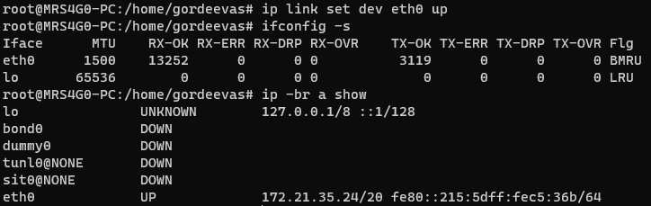

# Практическая работа №3. Настройка локальной сети

1. Исследуйте команды ip и ifconfig. Ответьте на вопрос – какая между ними
разница.

    Команда `ip` является универсальной командой для работы с сетевыми интерфейсами, адресами, маршрутами, правилами фильтрации и т.д. Команда `ifconfig` является устаревшей и используется для настройки сетевых интерфейсов.

   1. Используйте команды ip address и ifconfig в терминале, сравните результаты.

      

   2. Используйте команды ifconfig –s и ip –br a show, сравните результаты.

      

   3. Используйте команду ifconfig имя_интерфейса down, объясните назначение такого применения команды.

      `ifconfig eth0 down` - отключает интерфейс eth0

   4. Повторите действия из п.1.2, сравните результаты.

      

   5. Используйте команду ip link set dev имя_интерфейса up, объясните назначение такого применения команды (используйте то же имя_интерфейса, что и в п.1.3).

      `ip link set dev eth0 up` - включает интерфейс eth0

   6. Еще раз повторите действие из п.1.2.

      

   7. Используйте команды из п.1.2-1.6, однако командам из п.1.5 и 1.3 задайте параметры down и up соответственно. Сделайте общий вывод для этих двух команд.

      

   8. Выполните команды arp –a и ip n, опишите действия команд и сравните результаты выполнения

      Команда `arp -a` показывает таблицу ARP, а команда `ip n` показывает таблицу Neighbor. Вывод команды `arp -a` содержит MAC-адреса, а вывод команды `ip n` содержит MAC-адреса и состояние соседа.

   9. Используя команду ip задайте одному из сетевых адресов IP-адрес и маску в соответствии с вашим вариантом (не забудьте сохранить текущие настройки где-нибудь в блокноте).

      `ip addr add 192.168.199.199/24 dev eth0`

      

2. Исследуйте команду route.

   Команда route используется для просмотра и изменения таблицы маршрутизации.

   1. Найдите нужный параметр команды route, чтобы просмотреть таблицу маршрутизации.

      `route -n`

      

   2. Используя команду route и один из ее параметров для создания нового маршрута (для добавления его в таблицу маршрутизации).

      `route add -net 192.168.199.0/24 gw 172.21.32.0`

   3. Убедитесь, что новый маршрут из п.2.2 был создан.

      

   4. Удалите маршрут из п.2.2 и убедитесь в выполнении данной задачи.

      `route del -net 192.168.199.0/24 gw 172.21.32.0`

      

3. Исследуйте утилиты ping и traceroute.

   Утилита `ping` используется для проверки соединения с удаленным хостом. Утилита `traceroute` используется для определения маршрута следования пакетов от вашего хоста к удаленному хосту.

   1. Примените утилиту ping адрес_сервера для проверки соединения с вашим любимым сайтом в сети Интернет.

      `ping www.youtube.com`

      

   2. Измените количество пакетов, отправляемых утилитой ping. Дополнительно отключите отображение доменов.

      `ping -c 5 -n www.youtube.com`

      

   3. Используйте утилиту traceroute адрес_сервера (если необходимо, то установите ее в соответствии с инструкциями, которые вам подскажет терминал) для определения маршрута следования пакетов от вашего хоста к любимому сайту. Если вдруг вместо промежуточных узлов в выводе утилиты traceroute будут только * * *, то попробуйте применить команду с опцией –I. Опишите действие команды и назначение этой опции.

      Команда `traceroute` используется для определения маршрута следования пакетов от вашего хоста к удаленному хосту. При использовании опции `-I` вместо UDP-запросов используются ICMP-запросы.
      ICMP-запросы, это запросы на проверку связи между узлами. Они используются для проверки доступности узла, маршрута следования пакетов и определения времени жизни пакета.

      `traceroute -I www.youtube.com`

      

   4. Используйте утилиту traceroute без вывода доменных имен.

      `traceroute -n www.youtube.com`

      

4. Изучите команды netstat, host, dig.
   1. Исследуйте команду dig и опишите, для чего ее применяют.

      Команда `dig` используется для получения информации о домене. Она позволяет получить информацию о домене, его IP-адресах, серверах, которые обслуживают домен, и т.д.

   2. Примените команду dig для получения информации о домене vk.com.

      `dig vk.com`

      

   3. Выберите из вывода команды (п.4.2) один из IP-адресов и используйте команду dig для получения домена, привязанного к этому адресу.

      `dig -x 93.186.225.194`

      

   4. Исследуйте команду host. Опишите, для чего ее применяют и для чего используются опции -A и –t.

      Команда `host` используется для получения информации о домене. Она позволяет получить информацию о домене, его IP-адресах, серверах, которые обслуживают домен, и т.д. Опция `-A` используется для получения всех IP-адресов, связанных с доменом, а опция `-t` используется для указания типа запроса. Возможные типы запросов: A, NS, MX, SOA, CNAME, PTR, HINFO, TXT, AAAA, SRV, NAPTR, A6, DNAME, OPT, AXFR, MAILB, MAILA, ANY.

      Пример использования команды `host`:

      `host -A vk.com`

      

   5. Исследуйте команду netstat и опишите, для чего ее применяют. Изучите вывод команды при использовании опций –l, -n, -p, -t, -u, -a.

      Команда `netstat` используется для получения информации о сетевых соединениях и портах.

      Опции и их назначение:
      - `-l` используется для вывода только локальных сетевых адресов;
      - `-n` используется для вывода IP-адресов вместо имени хоста;
      - `-p` используется для вывода PID процесса, который использует сетевой сокет;
      - `-t` используется для вывода только TCP-соединений;
      - `-u` используется для вывода только UDP-соединений;
      - `-a` используется для вывода всех сетевых соединений.

      \
      Пример использования команды `netstat`:

      `netstat -a`

      

## Ответы на вопросы

1. Какие команды применяются для вывода информации о сетевых интерфейсах?

   `ifconfig`\
   `ip addr`

2. Как вывести информацию о сетевых интерфейсах в кратком виде?

   `ifconfig -a`

3. Какие команды вы будете использовать для того, чтобы программно выключить интерфейс?

   `ifconfig eth0 down`\
   `ip link set eth0 down`

4. Какие команды применяют для просмотра ARP-таблицы?

   `arp`\
   `ip n`

5. Как просмотреть таблицу маршрутизации?

   `route -n`\
   `ip r`

6. При помощи какой команды можно добавить новый маршрут в таблицу маршрутизации?

   `route add -net [src]/[mask] gw [gateway]`

7. Какая команда применяется для проверки доступности узлов в сети?

   `ping`

8. Как просмотреть маршрут следования пакетов от вашего хоста до сервера?

   `traceroute [address]`

9. Как узнать IP-адрес сервера по его доменному имени?

   `host [domain]`

10. Как просмотреть открытые в системе сетевые порты?

    `netstat -a`
