# Практическая работа №4

1. Изучить действие команды ps: общее назначение команды, назначение параметров –a, -x и –U.

        Команда отображает список активных процессов. Параметр -a отображает все процессы, включая процессы, не принадлежащие текущему пользователю. Параметр -x отображает процессы, не принадлежащие терминалу. Параметр -U отображает процессы, принадлежащие указанному пользователю.
    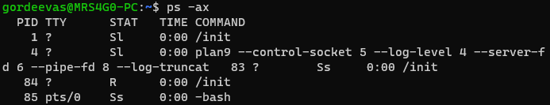

2. Изучить действие команды kill: общее назначение команды, параметры, PID. Для демонстрации работы необходимо создать новый процесс, определить его PID и завершить его, применив команду kill.

        Команда завершает процесс по его PID. PID можно узнать с помощью команды ps. Пример завершения процесса с PID 972
    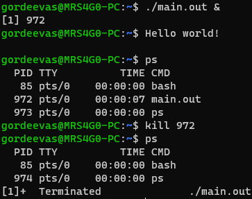

        Список сигналов представлен в скриншоте ниже.
    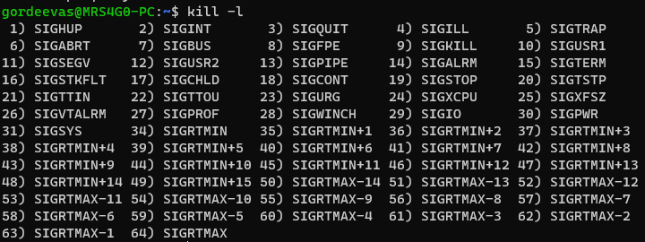

3. Изучить действие команды killall: общее назначение команды, отличия от команды kill. Для демонстрации работы необходимо создать новый процесс, определить его имя_процесса и завершить его, применив команду killall.

        Команда завершает все процессы с указанным именем. Пример завершения процесса с именем main.out
    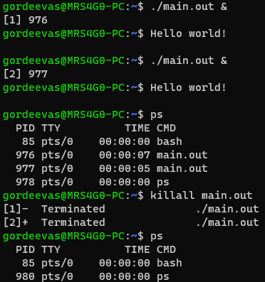

4. Изучить работу утилиты top: общее назначение утилиты, значение столбцов, параметры \<U>, \<D>, \<F>, \<H>. Установить утилиту htop. Сравните работу этих двух утилит.

        Утилита top отображает список активных процессов. Столбец PID - идентификатор процесса. Столбец USER - пользователь, запустивший процесс. Столбец PR - приоритет процесса. Столбец NI - приоритет процесса в диапазоне от -20 до 19. Столбец VIRT - общий объем виртуальной памяти, используемый процессом. Столбец RES - объем физической памяти, используемый процессом. Столбец SHR - объем физической памяти, используемый процессом, которая может быть использована другими процессами. Столбец S - статус процесса. Столбец %CPU - процент использования процессора процессом. Столбец %MEM - процент использования физической памяти процессом. Столбец TIME+ - время, затраченное процессом на выполнение. Столбец COMMAND - команда, запустившая процесс. Параметр <U> отображает процессы, принадлежащие текущему пользователю. Параметр <D> отображает процессы, которые используют дисковое пространство. Параметр <F> отображает процессы, которые используют файлы. Параметр <H> отображает процессы, которые используют сетевые соединения.
    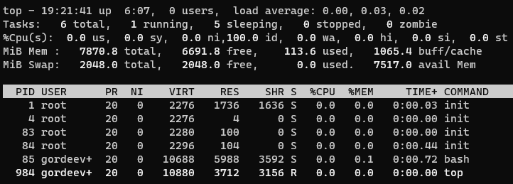

        Утилита htop также отображает информацию о процессах, но в более удобном виде. Она позволяет управлять процессами, например, завершать процессы, менять приоритет процессов. Также отображает нагруженность системы.

    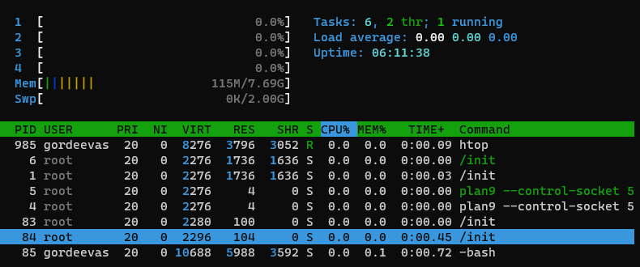

5. Изучить работу команд nice и renice: общее назначение команд, особенности применения.

        Команда nice позволяет запускать процессы с определенным приоритетом. По умолчанию приоритет процесса равен 0. Чем меньше значение приоритета, тем выше приоритет процесса. Приоритет процесса может быть изменен с помощью команды renice.

6. Изучите информационный механизм proc: общее назначение псевдофайловой системы, извлечение информации о версии ядра, о процессоре, об использовании оперативной памяти, о списке устройств, о файловых системах.

        Псевдофайловая система proc представляет собой дерево файловых систем, которые представляют собой информацию о процессах, устройствах, файловых системах, сетевых соединениях и т.д. Все эти файлы являются виртуальными и не занимают место на диске. Для того, чтобы получить доступ к этой информации, необходимо смонтировать файловую систему proc. Это можно сделать с помощью команды mount -t proc proc /proc. После этого в директории /proc появятся файлы, которые содержат информацию о процессах, устройствах, файловых системах, сетевых соединениях и т.д.

       Вывод информации о версии ядра:
    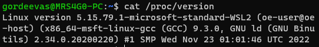
    
       Вывод информации о процессоре:
    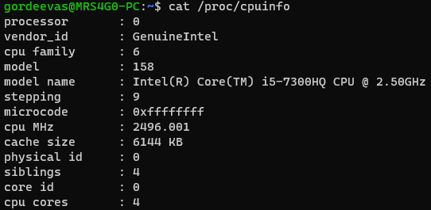
        
       Вывод информации об использовании оперативной памяти:
    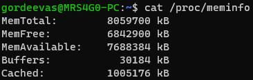
        
       Вывод информации о списке устройств:
    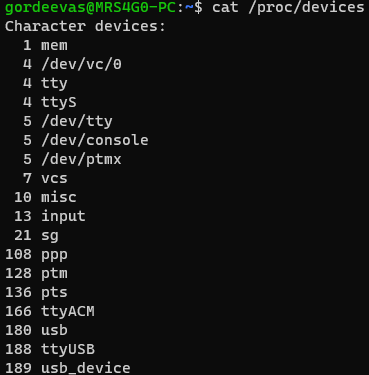

       Вывод информации о файловых системах:
    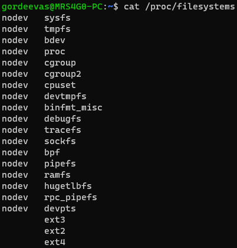

## Ответы на вопросы

1. При помощи каких команд и утилит пользователь может получить информацию о текущих процессах в системе?

        С помощью команды ps и утилиты top.

2. Какие команды применяют для того, чтобы завершить тот или иной процесс? Какие параметры при этом необходимо задать?

        Для завершения процесса используется команда kill. Для завершения процесса с идентификатором 1234 необходимо выполнить команду kill -9 1234.

3. Для чего применяют утилиты top и htop? В чем их различия?

        Утилита top показывает список процессов, которые выполняются в системе. Утилита htop показывает список процессов, которые выполняются в системе, но в отличие от утилиты top, утилита htop показывает список процессов в виде дерева.

4. Для чего применяют команды nice и renice?

        Команда nice позволяет задать приоритет процессу. Команда renice позволяет изменить приоритет процессу.

5. Какую информацию можно получить, используя псевдофайловую систему /proc?

        Информацию о процессах, об использовании оперативной памяти, о загруженности процессора, о версии ядра, о файловых системах, о списках устройств.
