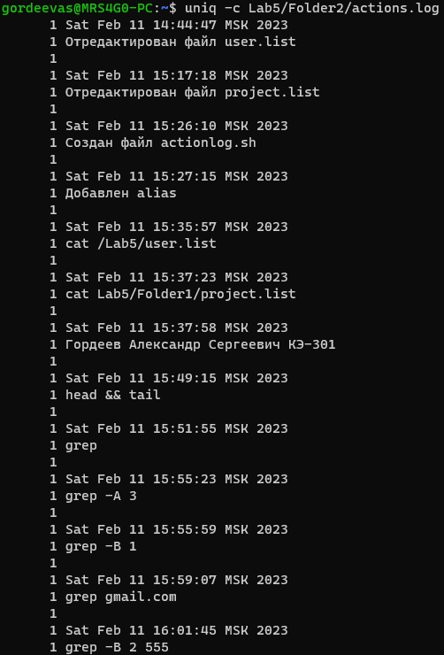

# Практическая работа №5. Работа с текстом

1. Используя терминал (консоль) создайте структуру каталогов и файлов, как показано на рисунке 1.

   `mkdir -p Lab5/Folder1 Lab5/Folder2 ; touch Lab5/Folder1/project.list Lab5/Folder2/actions.log Lab5/user.list`\
   

2. Используя текстовый редактор nano, отредактируйте файл user.list: задайте 5 блоков информации о пользователях, пример показан на рисунке 2. После завершения закройте с сохранением редактор nano (сочетание клавиш \<Ctrl+X>).

   `nano Lab5/user.list`

   ```md
   User: cheburashka
   ФИО: Чебурашка Крокодил Геннадьевич
   Должность: Президент
   Контектный телефон: 8-800-555-35-35
   e-mail: cheburashka@mail.ru

   User: grib
   ФИО: Грибочка Гриб Грибович
   Должность: Директор
   Контектный телефон: 8-800-777-77-77
   e-mail:grib@rambler.com

   User: krolik
   ФИО: Кроликов Кролик Кроликович
   Должность: Заместитель директора
   Контектный телефон: 8-800-555-55-55
   e-mail: krolik@gmail.com

   User: zayac
   ФИО: Заяцов Заяц Заяцович
   Должность: Секретарь
   Контектный телефон: 8-800-333-33-33
   e-mail: zayac@gmail.com

   User: medved
   ФИО: Медведев Медведь Медведевич
   Должность: Бухгалтер
   Контектный телефон: 8-800-111-11-11
   e-mail: medved@random.ru
   ```

   

   Добавьте в файл actions.log две строки, как показано на рисунке 3.

   `date >> Lab5/Folder2/actions.log && echo "Отредактирован файл user.list" >> Lab5/Folder2/actions.log`

3. Выполните редактирование файла project.list, пример показан на рисунке 4. Данные из файлов project.list и user.list должны пересекаться (например, по фамилиям пользователей). Не забудьте добавить 2 строки с описанием даты и действия в файл actions.log.

   `nano Lab5/Folder1/project.list`

   ```md
   Номер проекта: #1
   Название проекта: Проведение курса по Linux
   Руководитель проекта: Грибочка Г.Г.
   Исполнители проекта: Кроликов К.К., Заяцов З.З.

   Номер проекта: #2
   Название проекта: Проведение курса по Git
   Руководитель проекта: Кроликов К.К.
   Исполнители проекта: Заяцов З.З., Медведев М.М.

   Номер проекта: #3
   Название проекта: Проведение курса по Bash
   Руководитель проекта: Заяцов З.З.
   Исполнители проекта: Кроликов К.К., Медведев М.М.
   ```

   

   `date >> Lab5/Folder2/actions.log && echo "Отредактирован файл project.list" >> Lab5/Folder2/actions.log`

4. Чтобы не вбивать каждый раз сочетание команд date && echo создайте специальный скрипт. От имени суперпользователя запустите редактор nano. Добавьте в текстовом редакторе строки, показанные на рисунке 5. Более подробно процесс создания скриптов будет описан в практической работе 8.

   Сохраните скрипт в Folder2 под именем actionlog.sh.

   `nano Lab5/Folder2/actionlog.sh`

   ```bash
   #!/bin/bash

   echo " " >> ~/Lab5/Folder2/actions.log
   date >> ~/Lab5/Folder2/actions.log
   echo $1 >> ~/Lab5/Folder2/actions.log
   ```

   

   Сделайте ваш скрипт исполняемым, применив команду chmod +x.

   `chmod +x Lab5/Folder2/actionlog.sh`

   Вызовите скрипт в терминале, указав в качестве аргумента описание действия, как показано на рисунке 6.

   `./Lab5/Folder2/actionlog.sh "Создан файл actionlog.sh"`

   Чтобы не указывать путь к скрипту, создайте alias log, как показано на рисунке 7. Вызовите скрипт, используя созданный alias и проверьте, изменился ли файл actions.log.

   `alias log="~/Lab5/Folder2/actionlog.sh"`

   Теперь вы можете использовать псевдоним log для записи в журнал действий.

   `log "Добавлен alias"`

   `cat Lab5/Folder2/actions.log`\
   

5. Просмотрите содержимое файлов user.list и project.list при помощи команды cat. Не забудьте добавить в ваш журнал действий соответствующие записи (рисунок 8).

   `cat Lab5/user.list && log "cat /Lab5/user.list"`\
   `cat Lab5/Folder1/project.list && log "cat Lab5/Folder1/project.list"`\
   

   Итак, самое время вам представиться. Используя созданный вами псевдоним log, запишите в файл actions.log следующую строку, в указанном формате: «Фамилия Имя Отчество студента, Номер группы».

   `log "Гордеев Александр Сергеевич КЭ-301"`

6. Изучите команды head и tail продемонстрируйте преподавателю результат: последовательно выведите первые 5 строк файла user.list и последние 9 строк файла actions.log в окно терминала, как показано на рисунке 9.

   `log "head && tail" && head -n 5 Lab5/user.list && tail -n 9 Lab5/Folder2/actions.log`\
   

   Изучите команду grep и продемонстрируйте преподавателю результат:

   - Выведите строки в файле project.list, используя шаблон для поиска «Название проекта» (рисунок 10).

      `log "grep" && grep "Название проекта" Lab5/Folder1/project.list`\
      
   - Выведите строки в файле user.list, используя шаблон «ФИО», а также следующие за результатом 3 строки (рисунок 11);

      `log "grep -A 3" && grep -A 3 "ФИО" Lab5/user.list`\
      
   - Выведите строки в файле user.list, используя шаблон «ФИО», а также предшествующую им строку (рисунок 12);

      `log "grep -B 1" && grep -B 1 "ФИО" Lab5/user.list`\
      

   - придумайте пример, чтобы вывести строки, используя выбранный вами шаблон, плюсминус 2 строки (а рисунок-пример я вам не дам).

   - Вывод строк, содержащих gmail.com.

      `log "grep gmail.com" && grep "gmail.com" Lab5/user.list`\
      

   - Вывод строк, содержащих 555 и 2 строки предшествующих им.

      `log "grep -B 2 "555"" && grep -B 2 "555" Lab5/user.list`\
      

7. Изучите команды Linux, указанные в таблице и продемонстрируйте преподавателю результаты на основе разработанных вами примеров. sort uniq less comm past wc tr nl cut split.

   Команда | Описание | Пример | Скриншот
   --- | --- | --- | ---
   `sort` | Сортировка строк | `sort Lab5/user.list` | 
   `uniq` | Удаление дубликатов | `uniq -c Lab5/Folder2/actions.log` | 
   `less` | Просмотр содержимого файла | `less Lab5/user.list` | 
   `comm` | Сравнение двух файлов | `comm Lab5/user.list Lab5/Folder1/project.list` | 
   `paste` | Слияние файлов | `paste Lab5/user.list Lab5/Folder1/project.list` | 
   `wc` | Подсчет строк, слов и символов | `wc Lab5/user.list` | 
   `tr` | Замена символов | `tr " " "_" < Lab5/user.list` | 
   `nl` | Нумерация строк | `nl Lab5/Folder2/actions.log` | 
   `cut` | Выделение части строки | `cut -d " " -f 2 Lab5/user.list` | 
   `split` | Разделение файла на части | `split -l 5 Lab5/user.list` | 

8. Изучите команду tar:

   - создайте архив каталога Lab5;

      `log "tar -cvf" && tar -cvf Lab5.tar Lab5`\
      

   - выведите в терминал содержимое архива;

      `log "tar -tvf" && tar -tvf Lab5.tar`\
      

   - разархивируйте созданный архив в другой каталог.

      `mkdir another`\
      `log "tar -xvf" && tar -xvf Lab5.tar -C another`\
      

## Ответы на вопросы

1. Какую команду вы применяли для создания каталогов?

   `mkdir`

2. Какую команду вы применяли для создания пустых файлов?

   `touch`

3. Для чего применяют программу nano?

   `nano` - это текстовый редактор, который позволяет создавать и редактировать текстовые файлы.

4. Как перенаправить вывод команды в текстовый файл? Как выполнить это действие с полным стиранием содержимого файла перед записью?

   `>` - перенаправление вывода команды в файл (содержимое файла при этом стирается), `>>` - перенаправление вывода команды в файл с дозаписью.

5. Для чего вы вызывали последовательное выполнение команд date && echo?

   `date` - для того чтобы получить текущую дату, а затем `echo` - для того чтобы получить строку вывода для записи в файл.

6. Как сделать файл исполняемым?

   `chmod +x`

7. Что такое alias и для чего его применяют?

   `alias` - это команда, которая позволяет создавать сокращения для команд. Например, `alias l="ls -l"` - создаст сокращение `l` для команды `ls -l`.

8. Для чего применяют команду head? Как изменить количество строк в выводе?

   `head` - выводит первые 10 строк файла. Для изменения количества строк в выводе используется опция `-n`.

9. Для чего применяют команду tail? Как изменить количество строк в выводе?

      `tail` - выводит последние 10 строк файла. Для изменения количества строк в выводе используется опция `-n`.

10. Для чего применяют команду cat?

    `cat` - выводит содержимое файла.

11. Для чего применяют команду grep? Как указать количество строк в дополнении к стандартному выводу?

    `grep` - поиск строки в файле. Для указания количества строк в дополнении к стандартному выводу используется опция `-C`.

12. Для чего применяют команду sort?

    `sort` - сортировка строк в файле.

13. Для чего применяют команду uniq?

    `uniq` - выводит только уникальные строки в файле.

14. Для чего применяют команду less?

    `less` - выводит содержимое файла постранично.

15. Для чего применяют команду past?

    `past` - выводит содержимое файла построчно.

16. Для чего применяют команду comm?

    `comm` - сравнивает два отсортированных файла и выводит три столбца: в первом столбце строки, которые есть только в первом файле, во втором - только во втором файле, в третьем - строки, которые есть в обоих файлах.

17. Для чего применяют команду wc?

    `wc` - выводит количество строк, слов и байт в файле.

18. Для чего применяют команду tr?

    `tr` - заменяет символы в строке.

19. Для чего применяют команду cut?

    `cut` - выводит определенные столбцы из файла.

20. Для чего применяют команду nl?

    `nl` - выводит содержимое файла с указанием номера строки.

21. Для чего применяют команду split?

    `split` - разбивает файл на несколько файлов.

22. Для чего применяют команду tar? Какие опции этой команды вы знаете?

    `tar` - создание архивов и извлечение файлов из них.

    Опции команды `tar`:
    - `c` - создание архива;
    - `x` - извлечение файлов из архива;
    - `t` - просмотр содержимого архива;
    - `v` - подробный вывод;
    - `f` - указание имени файла архива;
    - `z` - сжатие архива;
    - `C` - указание каталога, в который будет произведено извлечение файлов из архива.
