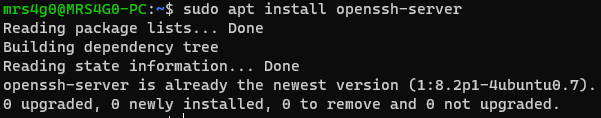
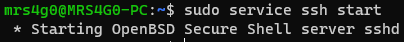
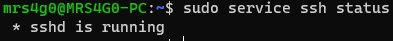
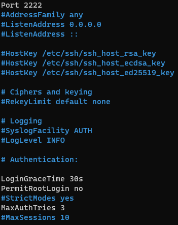
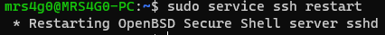

# Практическая работа №6. Безопасный удаленный доступ. Использование и настройка SSH

Варианm | Способ | Порт | Шифрование
------- | ------ | ---- | ----------
1 | init.d | 2222 | RSA

1. Проверьте, установлен ли в вашей OpenSSH. Если он не установлен, установите.

    ```bash
    sudo apt install openssh-server
    ```

    

2. Используйте один из способов запуска ssh-сервера в соответствии с вашим вариантом.

    ```bash
    sudo service ssh start
    ```

    

3. Проверьте статус вашего ssh-сервера.

    ```bash
    sudo service ssh status
    ```

    

4. Определите IP-адрес вашего ssh-сервера и подключитесь к нему по ssh.

    ```bash
    ssh mrs4g0@localhost
    ```

5. Создайте резервную копию конфигурационного файла с настройками sh.

    ```bash
    sudo cp /etc/ssh/sshd_config /etc/ssh/sshd_config.bak
    ```

6. Измените порт подключения по ssh в соответствующем конфигурационном файле согласно вашему варианту.

    ```bash
    sudo nano /etc/ssh/sshd_config
    ```

    ```bash
    Port 2222
    ```

    Запретите вход по ssh от имени root.

    ```bash
    PermitRootLogin no
    ```

    Установите время, за которое пользователь должен успеть подключиться по ssh. Время выберите из диапазона [20;40]. Например, 30 секунд.

    ```bash
    LoginGraceTime 30
    ```

    Ограничьте максимальное количество попыток входа по ssh значением из диапазона [2-5].

    ```bash
    MaxAuthTries 3
    ```

    

    Перезапустите ssh-сервер.

     ```bash
    sudo service ssh restart
    ```

    

7. Подключитесь к серверу с учетом новых настроек.

    ```bash
    ssh user@ip -p 2222
    ```

8. Запретите вход по паролю и настройте способ входа на ваш ssh-сервер по ключу. Сгенерируйте публичный и приватный ключи. Алгоритм шифрования выбирается в соответствии с вашим вариантом.

    ```bash
    ssh-keygen -t rsa
    ```

    Передача публичного ключа на сервер.

    ```bash
    ssh-copy-id user@ip -p 2222
    ```

    Подключение к серверу по ключу.

    ```bash
    ssh user@ip -p 2222
    ```

9. Перезапустите ssh-сервер и подключитесь к нему, используя ключи для входа.

    ```bash
    sudo service ssh restart
    ```

    ```bash
    ssh user@ip -p 2222
    ```

10. Настройте подключение к серверу по одноразовому паролю (Google-authentication).

    ```bash
    sudo apt install libpam-google-authenticator
    ```

    ```bash
    google-authenticator
    ```

    ```bash
    sudo nano /etc/pam.d/sshd
    ```

    ```bash
    auth required pam_google_authenticator.so
    ```

    ```bash
    sudo nano /etc/ssh/sshd_config
    ```

    ```bash
    ChallengeResponseAuthentication yes
    ```

    ```bash
    sudo service ssh restart
    ```

    ```bash
    ssh user@ip -p 2222
    ```

11. Измените приветственное сообщение: должна выводиться строка «Gordeev A. S. KE-301».

    ```bash
    sudo nano /etc/motd
    ```

    ```bash
    Gordeev A. S. KE-301
    ```

## Ответы на контрольные вопросы

1. Как определить, установлен ли в вашей системе OpenSSH?

    ```bash
    dpkg -l | grep openssh-server
    ```

2. При помощи какой команды вы установили в своей системе OpenSSH?

    ```bash
    sudo apt install openssh-server
    ```

3. При помощи какой команды вы запускали свой ssh-сервер? Какая альтернативная команда может быть применена?

    ```bash
    sudo service ssh start
    ```

    ```bash
    sudo systemctl start ssh
    ```

4. Как определить состояние ssh-сервера?

    ```bash
    sudo service ssh status
    ```

5. Для чего используется настройка PermitRootLogin?

    ```bash
    PermitRootLogin no
    ```

    Запрещает вход по ssh от имени root.

6. Для чего используется настройка PasswordAuthentication?

    ```bash
    PasswordAuthentication no
    ```

    Запрещает вход по паролю.

7. Для чего используется настройка PermitEmptyPasswords?

    ```bash
    PermitEmptyPasswords no
    ```

    Запрещает вход по пустому паролю.

8. Для чего используется настройка PubkeyAuthentication?

    ```bash
    PubkeyAuthentication yes
    ```

    Разрешает вход по ключу.

9. Для чего используется настройка MaxAuthTries?

    ```bash
    MaxAuthTries 3
    ```

    Ограничивает количество попыток входа по ssh.

10. Для чего используется настройка MaxStartups?

    ```bash
    MaxStartups 10:30:60
    ```

    Ограничивает количество одновременных подключений.

11. Для чего используется настройка LoginGraceTime?

    ```bash
    LoginGraceTime 30
    ```

    Устанавливает время, за которое пользователь должен успеть подключиться по ssh.

12. Что такое SSH-ключи? Какие выделяют виды этих ключей?

    SSH-ключи — это способ аутентификации, при котором вместо пароля используется пара ключей: публичный и приватный. Публичный ключ распространяется на все серверы, к которым вы хотите иметь доступ, а приватный ключ хранится только у вас. При подключении к серверу по ssh, сервер проверяет, что вы владеете приватным ключом, соответствующим публичному ключу, который вы предоставили. Если ключи совпадают, то сервер разрешает вам вход.

    Виды ключей:

    - RSA
    - DSA
    - ECDSA
    - ED25519

13. Как сгенерировать ключи для входа по ssh?

    ```bash
    ssh-keygen -t rsa
    ```

    ```bash
    ssh-keygen -t rsa -b 4096
    ```

    ```bash
    ssh-keygen -t dsa
    ```

    ```bash
    ssh-keygen -t ecdsa -b 521
    ```

    ```bash
    ssh-keygen -t ed25519
    ```
