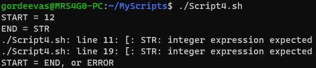

# Практическая работа №8. Создание сценариев

1. В вашем рабочем каталоге создайте папку “MyScripts” с использованием команды mkdir.

   `mkdir MyScripts`

2. Перейдите в каталог “MyScripts”, используя команду cd.

   `cd MyScripts`

3. Создайте в каталоге “MyScripts” файл “MyScript1.sh” используя команду nano.

   `nano MyScript1.sh`

4. В открывшемся файле напишите ваш первый bash-скрипт.

   ```bash
   #!/bin/bash

   echo "This is Message from Script"
   echo "Hello"
   ```

5. Сохраните и закройте файл вашего первого bash-скрипта.

   

6. Запустите ваш bash-скрипт:

   `./MyScript1.sh`

7. Оцените результат выполнения команды.

   

8. Запустите ваш bash-скрипт, используя команду bash.

   `bash MyScript1.sh`

9. Сравните результат выполнения команды с предыдущем вызовом (см. п.6).

   

10. Создайте в каталоге “MyScripts” файл “MyScript2.sh” используя команду nano.

    `nano MyScript2.sh`

11. В теле нового bash-скрипта запишите следующий код.

    ```bash
    #!/bin/bash

    echo "Let's show files in this folder"

    ls -l

    echo "Done"
    ```

12. Сохраните и закройте ваш новый скрипт. Вызовите его выполнение, используя команду bash.

    `bash MyScript2.sh`

13. В результате, у вас должен появиться список файлов в каталоге “MyScripts” с назначенными правами доступа.

    

14. Измените права доступа к этим двум файлам, используя команду chmod.

    `chmod a+x MyScript1.sh MyScript2.sh`

15. Запустите bash-скрипт “MyScript2.sh”.

    `./MyScript2.sh`

16. Оцените результат выполнения команды из п.14.

    

17. В bash-скрипте “MyScript3.sh” введите указанный ниже код. Затем выполните этот bash-скрипт.

    `nano MyScript3.sh`

    ```bash
    #!/bin/bash

    myOS=`uname -a`

    echo "My Operating System"
    echo "$myOS"
    ```

18. Оцените результат выполнения bash-скрипта.

    `./MyScript3.sh`

    

19. Создайте bash-скрипт “MyScript4.sh”. В его теле укажите следующий код.

    `nano MyScript4.sh`

    ```bash
    #!/bin/bash

    echo "This script name is $0"

    echo "Hello, $1"
    ```

20. Выполните bash-скрипт, указав входное значение свое имя. Например, так.

    `./MyScript4.sh Alexander`

21. Модифицируйте код, как показано ниже.

    ```bash
    #!/bin/bash

    echo "This script name is $0"

    echo "Hello, $1"
    echo "Hi, $2"
    ```

22. Запустите bash-скрипт, указав уже два входных значения. Например, так.

    `./MyScript4.sh Alexander Ivan`

    

23. Создайте bash-скрипт “MyScript5.sh”. В его теле укажите следующий код.

    `nano MyScript5.sh`

    ```bash
    #!/bin/bash

    Num1=123
    Num2=456
    Num3=789

    Summa=$((Num1+Num2+Num3))

    echo "$Num1 + $Num2 + $Num3 = $Summa"
    ```

24. Выполните bash-скрипт. Оцените результат.

    `./MyScript5.sh`

    

25. Создайте bash-скрипт “MyScript6.sh”. В его теле укажите следующий код.

    ```bash
    #!/bin/bash

    myHost=`hostname`
    myGTW='8.8.8.8'

    ping -c 4 $myGTW
    traceroute $myGTW
    
    echo -n "This is done..."
    echo "Really done"
    ```

26. Выполните bash-скрипт и оцените результат.

    `./MyScript6.sh`

    

27. Создайте в каталоге “MyScripts” файл “Script1.sh”. В теле bash-скрипта запишите указанный код.

    `nano Script1.sh`

    ```bash
    #!/bin/bash

    if [ "$1" -lt 5 ]; then
        echo "$1 < 5"
    elif [ "$1" -ge 10]; then
        echo "$1 >= 10"
        echo "5 <= $1 < 10"
    fi
    ```

    Сохраните bash-скрипт и примените его с одним целочисленным параметром несколько раз (например, с параметром 2, 7, 12).

    `./Script1.sh 2`\
    `./Script1.sh 7`\
    `./Script1.sh 12`

    Изучите результат для того, чтобы понять, как работает код bash-скрипта.

    

    Создайте новый или модифицируйте этот bash-скрипт, используя следующие операции сравнения: -eq, -ne, -gt, -ge, -lt, -le.

    ```bash
    #!/bin/bash

    if [ "$1" -lt 5 ]; then
        echo "$1 < 5"
    elif [ "$1" -ge 10]; then
        echo "$1 >= 10"
    elif [ "$1" -lt 10 ]; then
        echo "5 <= $1 < 10"
    fi
    ```

    

28. Создайте в каталоге “MyScripts” файл “Script2.sh”. В теле bash-скрипта запишите указанный код.

    `nano Script2.sh`

    ```bash
    #!/bin/bash

    if [ "$1" == "$2" ]; then
        echo "$1 equals $2"
    else
        echo "$1 is not equals to $2"
    fi

    if [ "$1" \> "$2" ]; then
        echo "ASCII: $1 > $2"
    elif [ "$1" = "$2" ]; then
        echo "ASCII: $1 = $2"
    else
        echo "ASCII: $1 < $2"
    fi

    if [ -z "$1" ]; then
        echo "variable 1 is empty"
    else
        echo "variable 1 is not empty"
    fi

    if [ -n "$2" ]; then
        echo "variable 2 is not empty"
    else
        echo "variable 2 is empty"
    fi
    ```

    Сохраните bash-скрипт и примените его с двумя строковыми параметрами несколько раз (например, с параметрами “Str” и “str”, “str” и “Str”, “STR1” и “STR”). Примените bash-скрипт с одним параметром, например, с “STR”. Изучите результат для того, чтобы понять, как работает код bash-скрипта.

    `./Script2.sh Str str`

    

    `./Script2.sh str Str`

    

    `./Script2.sh STR1 STR`

    

    `./Script2.sh STR`

    

29. Создайте в каталоге “MyScripts” файл “Script3.sh”. В теле bash-скрипта запишите указанный код.

    `nano Script3.sh`

    ```bash
    #!/bin/bash

    echo "Starting CASE selection..."

    read -p "Enter something: " x
    case $x in
        [1-5])
                echo "One - Five"
            ;;
        [6-9])
                echo "Six - Nine"
            ;;
        "Str")
                echo "Stroka"
            ;;
        *)
                echo "Parameter Unknown, sorry!"
            ;;
    esac
    ```

    Сохраните bash-скрипт и примените его. В качестве переменной после начала работы скрипта введите один параметр. Выполните процедуру несколько раз (например, с параметром 2, 7, “Str”, “LabuLabuDapDap”). Изучите результат для того, чтобы понять, как работает код bash-скрипта.

    `./Script3.sh 2`

    

    `./Script3.sh 7`

    

    `./Script3.sh Str`

    

    `./Script3.sh LabuLabuDapDap`

    

30. Создайте в каталоге “MyScripts” файл “Script4.sh”.     В теле bash-скрипта запишите указанный код.

    `nano Script4.sh`

    ```bash
    #!/bin/bash

    echo -n "START = "
    read START

    echo -n "END = "
    read END

    #echo "$START $END"

    if [ $START -lt $END ]; then
    #   echo "START > END"
        while [ $START -le $END ]; do
            echo -n "$START "
            START=$(($START+1))
    #       let START=START+1
    #       let START+=1
        done
    elif [ $START -gt $END ]; then
    #   echo "START < END"
        while [ $START -ge $END ]; do
            echo -n "$START "
            START=$(($START-1))
        done
    else
        echo "START = END, or ERROR"
    fi

    echo ""
    ```

    Сохраните bash-скрипт и примените его несколько раз. В первый раз – первый аргумент должен быть больше второго (например, 12 и 22). Во второй раз – второй аргумент больше первого (например, 16 и 4). В третий раз – первый и второй аргументы равны. В четвертый раз – вместо одного из аргументов введите символы (например, 12 и “STR”, или “STOP” и 1). Изучите результат для того, чтобы понять, как работает код bash-скрипта.

    `./Script4.sh 12 22`

    

    `./Script4.sh 16 4`

    

    `./Script4.sh 12 12`

    

    `./Script4.sh 12 STR`

    

    `./Script4.sh STOP 1`

    

31. В окне терминала создайте несколько текстовых файлов (не меньше 3х), как показано в примере.

    `echo "Hello World from file1.txt" >> file1.txt`\
    `echo "This is text in file file2.txt" >> file2.txt`\
    `echo "Bye World from file3.txt" >> file3.txt`

    Просмотрите список созданных вами текстовых файлов.

    `ls *.txt`

    

    Создайте в каталоге “MyScripts” файл “Script5.sh”. В теле bash-скрипта запишите указанный код.

    `nano Script5.sh`

    ```bash
    #!/bin/bash

    for myFile in 'ls *.txt'; do
        cat $myFile
    done
    ```

    Сохраните bash-скрипт и примените его. Изучите результат для того, чтобы понять, как работает код bash-скрипта.

    `./Script5.sh`

    

    Модифицируйте код bash-скрипта.

    ```bash
    #!/bin/bash

    for myfile in 'ls *.txt'; do
        cat $myfile
    done

    echo -n "" > myfile.txt
    for x in {1..20}; do
        echo "X = $x" >> myfile.txt
    done
    ```

    Сохраните bash-скрипт и примените его. Изучите результат для того, чтобы понять, как работает код bash-скрипта.

    `./Script5.sh`

    

    Модифицируйте bash-скрипт еще раз. Примените его. Изучите результат.

    ```bash
    #!/bin/bash

    for myfile in 'ls *.txt'; do
        cat $myfile
    done

    echo -n "" > myfile.txt
    for x in {1..20}; do
        echo "X = $x" >> myfile.txt
    done

    for (( i=1; i<=10; i++ )); do
        echo -n "$i " >> myfile.txt
    done
    echo "" >> myfile.txt
    ```

    `./Script5.sh`

    

32. Создайте в каталоге “MyScripts” файл “Script6.sh”. В теле bash-скрипта запишите указанный код.

    ```bash
    #!/bin/bash

    sum=0
    pr=0
    myFunctino()
    {
        sum=$(($1+$2))
        pr=$(($1*$2))
    }

    echo "Hello, $1"

    myFunctino $2 $3
    echo "$2 * $3 = $pr"
    echo "$2 + $3 = $sum"
    ```

    Сохраните bash-скрипт и примените его, задав 3 входных значения (например, значения “Mr.Freeman”, 6, 16). Изучите результат для того, чтобы понять, как работает код bash-скрипта.

    `./Script6.sh Mr.Freeman 6 16`

    

## Ответы на контрольные вопросы

1. Зачем в bash-скрипте в первой строке всегда указывают “#!/bin/bash”?

   Это указание на то, что скрипт будет исполняться в bash.

2. К какому результату приводит использование конструкции echo в bashскрипте?

    Выводит строку на экран.

3. Как в bash-скрипте прописать выполнение какой-либо команды, например, ls –l?

    `$(ls -l)`

4. К какому результату приводит выполнение команды chmod a+x?

   Параметр a+x означает, что для всех пользователей будет установлен флаг исполнения.

5. Как в bash-скрипте задать переменную и присвоить ей вывод какой-либо команды?

    `myVar=$(ls -l)`

6. Как в bash-скрипте вывести на экран значение переменной?

   `echo $myVar`

7. Какое значение хранит в себе переменная “$0”?

   Имя скрипта.

8. Как использовать переменные в bash-скрипте так, чтобы им присваивались значения, указанные при выполнении bash-скрипта?

    `./Script1.sh 1 2 3`

9. Как в bash-скрипте выполнять арифметические действия?

    `echo $(($1+$2))`

10. Как в bash-скрипте выполнить команду echo таким образом, чтобы курсор не переходил на строку ниже?

    `echo -n "Hello World"`

11. Как в bash-скриптах работает конструкция if-elif-else-fi? Что такое fi в этой конструкции?

    `if-elif-else-fi` - это конструкция, которая позволяет выполнять различные действия в зависимости от условий. `fi` - это конец конструкции.

12. Какие операции сравнения можно выполнить в конструкции if-elif-else-fi?

    - `-eq` - равно
    - `-ne` - не равно
    - `-gt` - больше
    - `-lt` - меньше
    - `-ge` - больше или равно
    - `-le` - меньше или равно

13. Какой код bash-скрипта позволяет пользователю вводить значения параметров при его (скрипта) выполнении?

    `read myVar`

14. Как работает в bash-скриптах конструкция case-esac? Что такое esac?

    `case-esac` - это конструкция, которая позволяет выполнять различные действия в зависимости от условий. `esac` - это конец конструкции.

15. Как в bash-скриптах реализуется цикл while?

    ```bash
    while [ $i -le 10 ]; do
        echo $i
        i=$(($i+1))
    done
    ```

16. Как в bash-скриптах реализуется цикл for?

    ```bash
    for (( i=1; i<=10; i++ )); do
        echo $i
    done
    ```

17. Как в bash-скриптах можно записать echo в файл?

    `echo "Hello World" >> myfile.txt`

18. Как задать функцию в bash-скрипте? Как передавать в нее параметры?

    ```bash
    myFunction()
    {
        echo "Hello, $1"
    }
    ```
